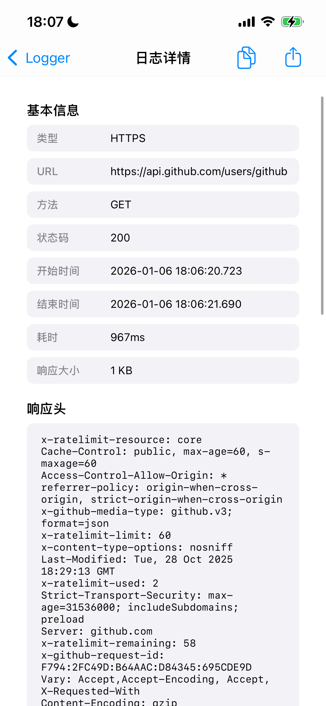
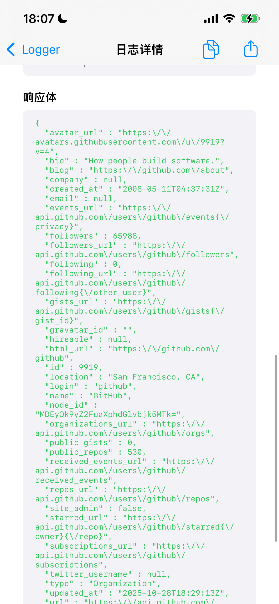

# SJLogger

[](https://travis-ci.org/SJLogger)
[](https://cocoapods.org/pods/SJLogger)
[](https://cocoapods.org/pods/SJLogger)
[](https://cocoapods.org/pods/SJLogger)

一个强大的iOS网络日志查看框架，类似CocoaDebug，支持实时监控、查看、复制和分享网络请求日志。

## 功能特性

- ✅ **自动拦截所有请求**：使用Method Swizzling技术，自动拦截所有网络请求（包括第三方SDK）
- ✅ **实时日志记录**：实时记录和展示网络请求详情
- ✅ **悬浮窗入口**：小圆圈悬浮窗显示日志数量，可拖动、点击查看、长按清除
- ✅ **日志搜索过滤**：支持关键词搜索和多种过滤条件（成功/失败/类型）
- ✅ **多选导出**：支持全部导出或选择性导出日志
- ✅ **WebSocket日志**：支持WebSocket连接和消息日志记录
- ✅ **详细信息展示**：完整显示请求头、请求体、响应头、响应体
- ✅ **性能统计**：显示请求耗时、响应大小等统计信息
- ✅ **零侵入集成**：无需修改第三方库代码，自动监听所有请求
- ✅ **美观UI**：现代化卡片式设计，流畅的交互体验

## 截图

<p align="center">
  
  
  
</p>

## 系统要求

- iOS 15.0+
- Swift 5.0+
- Xcode 13.0+

## 安装

### CocoaPods

**推荐方式**：仅在 Debug 模式下集成

在你的 `Podfile` 中添加：

```ruby
pod 'SJLogger', :configurations => ['Debug']
```

或者在所有配置下安装：

```ruby
pod 'SJLogger'
```

然后运行：

```bash
pod install
```

## 使用方法

### 1. 基础使用

**重要**：
- 使用 `#if DEBUG` 确保仅在 Debug 模式下启用
- 在设置根控制器后调用 `start()`
- 在切换 TabBar 或重新设置根控制器时也需要调用

```swift
#if DEBUG
import SJLogger
#endif

// SwiftUI App
@main
struct MyApp: App {
    var body: some Scene {
        WindowGroup {
            ContentView()
                .onAppear {
                    #if DEBUG
                    // 在视图出现后启动SJLogger
                    SJLogger.shared.start()
                    #endif
                }
        }
    }
}

// UIKit App - SceneDelegate
func scene(_ scene: UIScene, willConnectTo session: UISceneSession, options connectionOptions: UIScene.ConnectionOptions) {
    guard let windowScene = (scene as? UIWindowScene) else { return }
    
    window = UIWindow(windowScene: windowScene)
    window?.rootViewController = UINavigationController(rootViewController: ViewController())
    window?.makeKeyAndVisible()
    
    #if DEBUG
    // ⚠️ 设置根控制器后立即启动SJLogger
    SJLogger.shared.start()
    #endif
}

// 切换TabBar或重新设置根控制器时
func switchToMainTabBar() {
    let tabBarController = UITabBarController()
    // ... 配置TabBar
    
    window?.rootViewController = tabBarController
    
    #if DEBUG
    // ⚠️ 重新设置根控制器后，需要再次调用start()
    SJLogger.shared.start()
    #endif
}
```

**注意**：
- ⚠️ **每次设置根控制器后都需要调用 `start()`**（包括切换TabBar、退出登录等场景）
- ✅ `start()` 方法可以多次调用，内部会自动处理重复调用
- ✅ 每次调用都会更新悬浮窗状态，确保悬浮窗正确显示
- ✅ **即使延迟调用 `start()`，也能监听到所有网络请求**（Method Swizzling 在首次访问 `SJLogger.shared` 时自动执行）

### 2. 自定义配置

```swift
#if DEBUG
// 启动SJLogger
SJLogger.shared.start { config in
    // 配置日志记录
    config.isEnabled = true
    config.maxLogCount = 500
    config.logRequestBody = true
    config.logResponseBody = true
    config.enableWebSocketLog = false
    config.showFloatingWindow = true
    config.printToConsole = false
    
    // 不设置 addMonitoredURL 则监控所有请求
    // 如果需要只监控特定URL，可以添加：
    config.addMonitoredURL(pattern: "api.example.com")
    // config.addMonitoredURL(pattern: ".*\\.myapi\\.com/.*")
    
    // 添加需要忽略的URL模式
    config.addIgnoredURL(pattern: ".*\\.png$")
    config.addIgnoredURL(pattern: ".*\\.jpg$")
    config.addIgnoredURL(pattern: ".*\\.gif$")
    config.addIgnoredURL(pattern: ".*\\.jpeg$")
}
#endif
```

### 3. 手动显示日志界面

```swift
#if DEBUG
// 从当前视图控制器显示日志列表
SJLogger.shared.showLogList(from: self)

// 或者自动查找顶层视图控制器
SJLogger.shared.showLogList()
#endif
```

### 4. 日志管理

```swift
// 清除所有日志
SJLogger.shared.clearLogs()

// 导出所有日志
SJLogger.shared.exportLogs { logText in
    print(logText)
    // 可以保存到文件或分享
}

// 获取日志统计信息
SJLogger.shared.getStatistics { stats in
    print("Total logs: \(stats["total"] ?? 0)")
    print("Success: \(stats["success"] ?? 0)")
    print("Failed: \(stats["failed"] ?? 0)")
}
```

### 6. 悬浮窗控制

```swift
// 显示悬浮窗
SJLogger.shared.showFloatingWindow()

// 隐藏悬浮窗
SJLogger.shared.hideFloatingWindow()
```

### 7. 停止日志记录

```swift
// 停止SJLogger
SJLogger.shared.stop()
```

## 高级功能

### 日志搜索和过滤

在日志列表界面中：
- 使用搜索栏搜索URL、方法、请求/响应内容
- 点击过滤按钮选择：全部、成功请求、失败请求、按类型过滤
- 左滑日志项可以删除或分享单条日志

### 日志详情

点击任意日志查看详细信息：
- 基本信息（URL、方法、状态码、耗时等）
- 请求头和请求体（支持JSON格式化）
- 响应头和响应体（支持JSON格式化）
- 支持复制和分享完整日志

### 多选导出

1. 点击左上角"选择"按钮进入编辑模式
2. 点击要导出的日志（会显示 ✓ 标记）
3. 点击导出按钮导出选中的日志
4. 点击"取消"退出编辑模式

**提示**：
- 普通模式下点击导出按钮会导出全部日志
- 编辑模式下点击导出按钮只导出选中的日志

## WebSocket 日志记录

SJLogger 支持手动记录 WebSocket 事件：

```swift
import SJLogger

// 连接建立
SJLogger.logWebSocket(url: "wss://example.com/socket", event: .connected(headers: [:]))

// 接收文本消息
SJLogger.logWebSocket(url: "wss://example.com/socket", event: .text("Hello"))

// 发送文本消息
SJLogger.logWebSocket(url: "wss://example.com/socket", event: .text("World"))

// 连接断开
SJLogger.logWebSocket(url: "wss://example.com/socket", event: .disconnected(code: 1000, reason: "Normal"))

// 错误
SJLogger.logWebSocket(url: "wss://example.com/socket", event: .error(NSError(...)))
```

### 与 Starscream 集成示例

```swift
import Starscream
import SJLogger

extension ChatSocketManager: WebSocketDelegate {
    func didReceive(event: WebSocketEvent, client: any WebSocketClient) {
        let url = "wss://example.com/socket"
        
        // 转发事件到SJLogger
        switch event {
        case .connected(let headers):
            SJLogger.logWebSocket(url: url, event: .connected(headers))
            
        case .text(let string):
            SJLogger.logWebSocket(url: url, event: .text(string))
            
        case .binary(let data):
            SJLogger.logWebSocket(url: url, event: .binary(data))
            
        case .disconnected(let reason, let code):
            SJLogger.logWebSocket(url: url, event: .disconnected(reason, code))
            
        case .error(let error):
            SJLogger.logWebSocket(url: url, event: .error(error))
            
        case .ping(let data):
            SJLogger.logWebSocket(url: url, event: .ping(data))
            
        case .pong(let data):
            SJLogger.logWebSocket(url: url, event: .pong(data))
            
        case .viabilityChanged(let isViable):
            SJLogger.logWebSocket(url: url, event: .viabilityChanged(isViable))
            
        case .reconnectSuggested(let shouldReconnect):
            SJLogger.logWebSocket(url: url, event: .reconnectSuggested(shouldReconnect))
            
        case .cancelled:
            SJLogger.logWebSocket(url: url, event: .cancelled)
            
        case .peerClosed:
            SJLogger.logWebSocket(url: url, event: .peerClosed)
        }
    }
}
```

#### WebSocket 日志记录 API

只需要一个方法：
- `SJLogger.logWebSocket(url:event:)` - 记录所有WebSocket事件

支持的事件类型（`SJWebSocketEvent`）：
- `.connected([String: String])` - 连接建立
- `.disconnected(String, UInt16)` - 断开连接
- `.text(String)` - 文本消息
- `.binary(Data)` - 二进制消息
- `.error(Error?)` - 错误
- `.ping(Data?)` / `.pong(Data?)` - 心跳
- `.viabilityChanged(Bool)` - 连接可用性变化
- `.reconnectSuggested(Bool)` - 重连建议
- `.cancelled` - 取消
- `.peerClosed` - 对端关闭

## 注意事项

1. **仅在Debug模式使用**：建议仅在Debug模式下启用SJLogger，避免在Release版本中使用
2. **内存管理**：设置合理的`maxLogCount`避免内存占用过大
3. **敏感信息**：注意日志中可能包含敏感信息，不要随意分享
4. **性能影响**：日志记录会有轻微的性能影响，但已优化到最小
5. **第三方库**：使用Moya、Alamofire等第三方网络库时，需要手动配置Session

## 示例项目

运行示例项目：

```bash
cd Example
pod install
open SJLogger.xcworkspace
```

## 架构设计

```
SJLogger
├── Models          # 数据模型
│   ├── SJLoggerModel.swift      # 日志数据模型
│   └── SJLoggerConfig.swift     # 配置模型
├── Core            # 核心功能
│   ├── SJURLProtocol.swift      # 网络拦截器
│   ├── SJURLSessionSwizzler.swift # Method Swizzling
│   └── SJLoggerStorage.swift    # 日志存储管理
├── UI              # 用户界面
│   ├── SJLogListViewController.swift   # 日志列表
│   ├── SJLogCell.swift                 # 列表Cell
│   ├── SJLogDetailViewController.swift # 日志详情
│   └── SJFloatingWindow.swift          # 悬浮窗
└── SJLogger.swift  # 主入口类
```

## 更新日志

### Version 0.3.0
- 初始版本发布
- 支持HTTP/HTTPS请求拦截
- 完整的UI界面
- 日志搜索、过滤、复制、分享功能

## 贡献

欢迎提交Issue和Pull Request！

## 作者

shengjie, shengjie

## 许可证

SJLogger is available under the MIT license. See the LICENSE file for more info.
