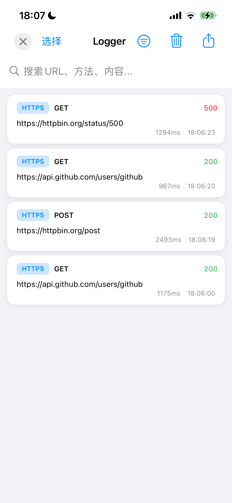
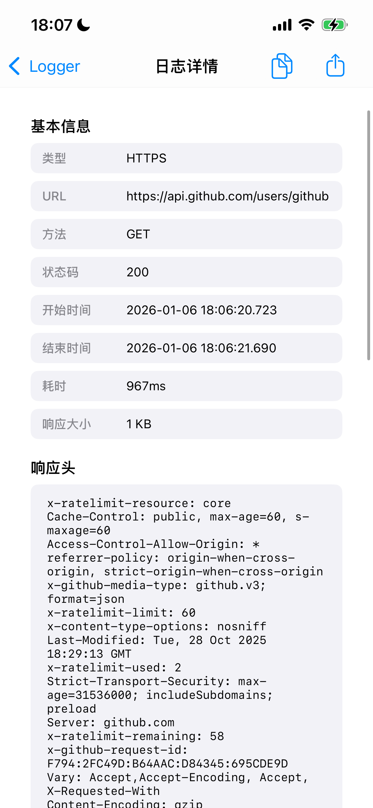
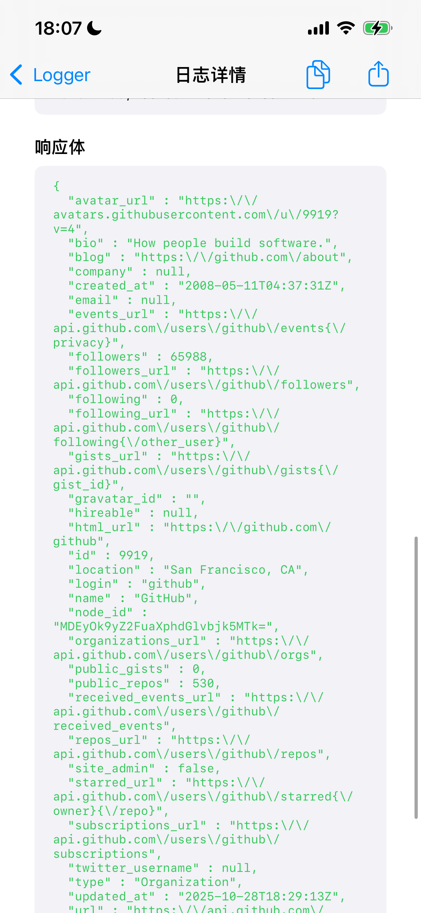

# SJLogger

[](https://cocoapods.org/pods/SJLogger)
[](https://cocoapods.org/pods/SJLogger)
[](https://cocoapods.org/pods/SJLogger)
[](https://swift.org)

SJLogger 是一个 iOS App 内网络日志调试工具，用于在 Debug/测试包里直接查看 HTTP/HTTPS 请求、WebSocket 消息、请求体、响应体、Header、耗时、状态码、失败原因、慢请求和流量统计。

它适合日常开发、测试联调、QA 验证、线上问题复现包排查等场景。很多时候不需要再额外挂 Charles、Proxyman，也不用在 Xcode 控制台里翻一堆日志，点开 App 内悬浮球就能直接看请求详情。

## 解决什么问题

- 在 App 内直接查看接口请求和响应。
- 快速定位接口失败、慢请求、状态码异常、响应体异常。
- 查看第三方 SDK 或业务代码发出的网络请求。
- 按接口路径聚合，找出调用频繁、失败率高、耗时高的接口。
- 搜索 URL、方法、Header、请求体、响应体内容。
- 导出日志、cURL、HAR，方便发给后端或测试同学。
- App 重启后仍可查看持久化日志。
- 请求体/响应体加密时，可配置 AES 或自定义解密器展示明文。
- 支持 WebSocket 连接、断开、收发消息、错误事件记录。

## 功能特性

- 自动捕获 HTTP/HTTPS 请求。
- 悬浮球入口，显示当前日志数量，点击打开日志页。
- 长按悬浮球清空当前内存日志，不会清除磁盘持久化日志。
- 自定义顶部导航栏，不受宿主 App 全局 `UINavigationBar` 样式影响。
- 请求列表和接口分组两种视图。
- 顶部统计：总数、成功率、平均耗时、总流量。
- 快捷筛选：全部、成功、失败、HTTP、WebSocket。
- 高级筛选：类型、方法、状态码段、慢请求、仅失败。
- 动态/固定刷新模式，查看历史日志时新请求不会打断当前列表。
- 详情页展示请求头、请求体、响应头、响应体、错误、耗时等信息。
- JSON 高亮展示，适配深色/浅色模式。
- 支持复制、分享、cURL 导出、HAR 导出、多选导出。
- 支持日志持久化到磁盘，并按最大存储空间自动裁剪旧日志。
- 设置页集中管理采集、悬浮窗、刷新模式、慢请求阈值、持久化、清理等配置。
- Core 默认零第三方依赖。
- 可选 `SJLogger/Starscream` 子库，用于 Starscream WebSocket 自动记录。

## 截图

<p align="center">
  
  
  
</p>

## 环境要求

- iOS 15.0+
- Swift 5.0+
- Xcode 13.0+

## 安装

### 默认安装

推荐只在 Debug 配置中集成：

```ruby
pod 'SJLogger', '~> 0.4.0', :configurations => ['Debug']
```

如果你希望所有配置都安装：

```ruby
pod 'SJLogger', '~> 0.4.0'
```

`pod 'SJLogger'` 默认只会安装 `SJLogger/Core`，不会引入 Starscream。

### Starscream 支持

如果项目里使用 Starscream，并希望自动记录 WebSocket 连接、断开、接收消息、错误等事件：

```ruby
pod 'SJLogger/Starscream', '~> 0.4.0', :configurations => ['Debug']
```

这个子库会额外引入：

```ruby
pod 'Starscream', '~> 4.0'
```

## 快速开始

在设置完根控制器之后启动 SJLogger：

```swift
#if DEBUG
import SJLogger
#endif

func scene(_ scene: UIScene,
           willConnectTo session: UISceneSession,
           options connectionOptions: UIScene.ConnectionOptions) {
    guard let windowScene = scene as? UIWindowScene else { return }

    window = UIWindow(windowScene: windowScene)
    window?.rootViewController = UINavigationController(rootViewController: ViewController())
    window?.makeKeyAndVisible()

    #if DEBUG
    SJLogger.shared.start()
    #endif
}
```

如果你的 App 后续重新设置了 `window.rootViewController`，比如登录后切换 TabBar、退出登录回到登录页，建议重新调用一次：

```swift
#if DEBUG
SJLogger.shared.start()
#endif
```

`start()` 可以多次调用，内部会处理重复启动，并刷新悬浮窗状态。

## 常用配置

```swift
#if DEBUG
SJLogger.shared.start { config in
    // 是否启用日志采集
    config.isEnabled = true

    // 是否显示悬浮球
    config.showFloatingWindow = true

    // 是否记录请求体/响应体
    config.logRequestBody = true
    config.logResponseBody = true
    config.maxResponseBodySize = 1024 * 1024

    // WebSocket 日志
    config.enableWebSocketLog = true

    // 是否打印到控制台
    config.printToConsole = false

    // 持久化到磁盘，0.4.0 默认开启
    config.persistLogs = true
    config.maxPersistedLogFileSize = 10 * 1024 * 1024

    // 默认监控所有 URL。只有需要白名单时才添加 monitoredURL。
    // config.addMonitoredURL(pattern: "api.example.com")

    // 忽略静态资源或无意义请求
    config.addIgnoredURL(pattern: ".*\\.png$")
    config.addIgnoredURL(pattern: ".*\\.jpg$")
    config.addIgnoredURL(pattern: ".*\\.gif$")
}
#endif
```

## 手动打开界面

```swift
#if DEBUG
// 自动查找当前顶层控制器
SJLogger.shared.showLogList()

// 从指定控制器弹出
SJLogger.shared.showLogList(from: viewController)

// 打开设置页
SJLogger.shared.showSettings(from: viewController)
#endif
```

## 日志导出

```swift
SJLogger.shared.exportLogs { text in
    print(text)
}
```

界面里也可以直接导出：

- 列表页点击导出按钮：导出当前日志。
- 进入选择模式后点击导出：只导出选中的日志。
- 详情页支持复制、分享、复制 cURL、导出 HAR。
- 设置页支持查看和导出磁盘持久化日志。

## 持久化日志

SJLogger 区分两类日志：

- 当前日志：App 本次运行期间采集到的日志，打开日志页默认展示它。
- 持久化日志：写入磁盘的日志，需要在设置页里主动查看或导出。

持久化默认开启。磁盘日志不按条数限制，而是按最大文件空间限制；超过限制时会优先丢弃旧日志。

```swift
SJLogger.shared.start { config in
    config.persistLogs = true
    config.maxPersistedLogFileSize = 20 * 1024 * 1024
}
```

长按悬浮球只会清空当前内存日志，不会清除持久化日志。持久化日志需要到设置页中主动清除。

## 请求体/响应体解密

如果请求体或响应体是加密数据，可以配置展示用的解密器。SJLogger 会把原始 `Data` 传给解密器，解密器返回的字符串会用于 UI 展示和导出。

### AES-CBC-PKCS7

```swift
SJLogger.shared.start { config in
    config.setAESBodyDecryptor(
        key: "1234567890123456",
        iv: "1234567890123456"
    )
}
```

说明：

- key 支持 16、24、32 字节。
- iv 默认可不传，不传时内部会使用 key。
- 会优先把 body 当作 Base64 字符串解密，失败后再按原始 bytes 解密。

### 自定义解密

```swift
SJLogger.shared.start { config in
    config.setBodyDecryptor { data in
        // 返回 nil 时会回退到 UTF-8/Hex 展示
        return String(data: data, encoding: .utf8)
    }
}
```

## WebSocket 日志

### 手动记录

Core 模块不依赖任何 WebSocket 库，也可以手动记录事件：

```swift
import SJLogger

SJLogger.logWebSocket(url: "wss://example.com/socket", event: .connected([:]))
SJLogger.logWebSocket(url: "wss://example.com/socket", event: .text("hello"))
SJLogger.logWebSocket(url: "wss://example.com/socket", event: .disconnected("normal", 1000))
SJLogger.logWebSocket(url: "wss://example.com/socket", event: .error(error))

// 发送方向需要在 write 的地方补充记录
SJLogger.logWebSocketSent(url: "wss://example.com/socket", text: "client message")
```

### Starscream 自动记录

安装：

```ruby
pod 'SJLogger/Starscream', '~> 0.4.0'
```

接入方式是用 `SJStarscreamProxy` 包一层你原来的 `WebSocketDelegate`。原来的代理不会失效，因为 proxy 记录日志后会继续转发事件。

```swift
import SJLogger
import Starscream

final class ChatSocketManager: NSObject, WebSocketDelegate {
    private var socket: WebSocket?
    private var loggerProxy: SJStarscreamProxy?
    private let urlString = "wss://example.com/socket"

    func connect() {
        let request = URLRequest(url: URL(string: urlString)!)
        let socket = WebSocket(request: request)

        // 关键：proxy 要强持有，否则会释放
        let proxy = SJLogger.starscreamProxy(url: urlString, forwarding: self)
        loggerProxy = proxy

        socket.delegate = proxy
        socket.connect()

        self.socket = socket
    }

    func didReceive(event: WebSocketEvent, client: WebSocketClient) {
        // 这里仍然是你原本的业务代理逻辑
    }

    func send(_ text: String) {
        socket?.write(string: text)

        // Starscream delegate 监听不到发送方向，需要在发送处补一条
        SJLogger.logWebSocketSent(url: urlString, text: text)
    }
}
```

注意：

- 必须强持有 `loggerProxy`。
- 设置 proxy 后不要再执行 `socket.delegate = 其他对象`，否则会覆盖日志代理。
- Starscream 自动记录连接、断开、接收、错误、ping/pong 等事件。
- 发送消息需要在调用 `write` 的地方手动补充。

## 界面说明

- 悬浮球：点击打开日志页，长按清空当前日志。
- 顶部统计：总数、成功率、平均耗时、总流量。
- 请求页：按请求/事件逐条展示。
- 接口页：按 path 聚合接口，展示调用次数、成功率、平均耗时。
- 搜索：支持 URL、方法、Header、请求体、响应体。
- 快捷筛选：全部、成功、失败、HTTP、WebSocket。
- 高级筛选：类型、方法、状态码段、慢请求、仅失败。
- 详情页：查看 Header、Body、错误、耗时，支持复制/分享/导出。
- 设置页：管理采集开关、悬浮球、刷新模式、慢请求阈值、持久化、清理。

## API 总览

```swift
SJLogger.shared.start()
SJLogger.shared.stop()

SJLogger.shared.showFloatingWindow()
SJLogger.shared.hideFloatingWindow()

SJLogger.shared.showLogList()
SJLogger.shared.showSettings()

SJLogger.shared.clearLogs()
SJLogger.shared.exportLogs { text in }
SJLogger.shared.getStatistics { stats in }

SJLogger.logWebSocket(url: "wss://...", event: .text("..."))
SJLogger.logWebSocketSent(url: "wss://...", text: "...")
```

## 注意事项

- 建议只在 Debug 或内部测试包中使用。
- 日志可能包含 token、cookie、用户隐私数据、业务敏感数据，导出和分享前请确认安全。
- 如果业务请求体/响应体很大，建议合理设置 body 大小和持久化空间限制。
- 某些自定义 `URLSessionConfiguration` 或特殊三方网络库，需要在项目中实际验证捕获效果。
- 如果使用 `SJLogger/Starscream`，请确认没有其他代码后续覆盖 `socket.delegate`。

## 示例项目

```bash
cd Example
pod install
open SJLogger.xcworkspace
```

## 项目结构

```text
SJLogger
├── Core
│   ├── SJURLProtocol.swift
│   ├── SJURLSessionSwizzler.swift
│   ├── SJLoggerStorage.swift
│   └── SJLogExporter.swift
├── Extensions
│   ├── SJLogger+WebSocket.swift
│   └── SJStarscreamAdapter.swift
├── Models
│   ├── SJLoggerModel.swift
│   ├── SJLoggerConfig.swift
│   ├── SJLogQuery.swift
│   └── SJEndpointGroup.swift
├── UI
│   ├── SJLogListViewController.swift
│   ├── SJLogDetailViewController.swift
│   ├── SJLogFilterViewController.swift
│   ├── SJLoggerSettingsViewController.swift
│   ├── SJEndpointListViewController.swift
│   ├── SJFloatingWindow.swift
│   └── SJUIComponents.swift
└── SJLogger.swift
```

## 更新日志

### 0.4.0

- 新增自定义导航栏，避免宿主项目全局导航栏样式影响 SJLogger 界面。
- 新增接口分组、顶部统计、高级筛选、动态/固定刷新模式。
- 新增 JSON 高亮、cURL/HAR 导出、多选导出。
- 新增磁盘持久化，并支持按最大存储空间限制。
- 新增设置页，可查看/导出/清理持久化日志。
- 新增 AES 和自定义请求体/响应体解密器。
- 新增 `SJLogger/Starscream` 可选子库。
- 优化悬浮球尺寸和长按清空当前日志行为。

### 0.3.0

- 支持 HTTP/HTTPS 请求捕获。
- 支持日志列表、详情、搜索、复制、分享、悬浮球入口。

## 作者

Shengjie

## License

SJLogger is available under the MIT license. See the LICENSE file for details.
